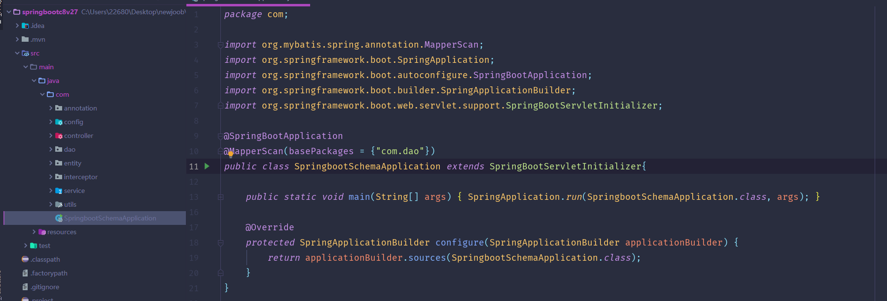
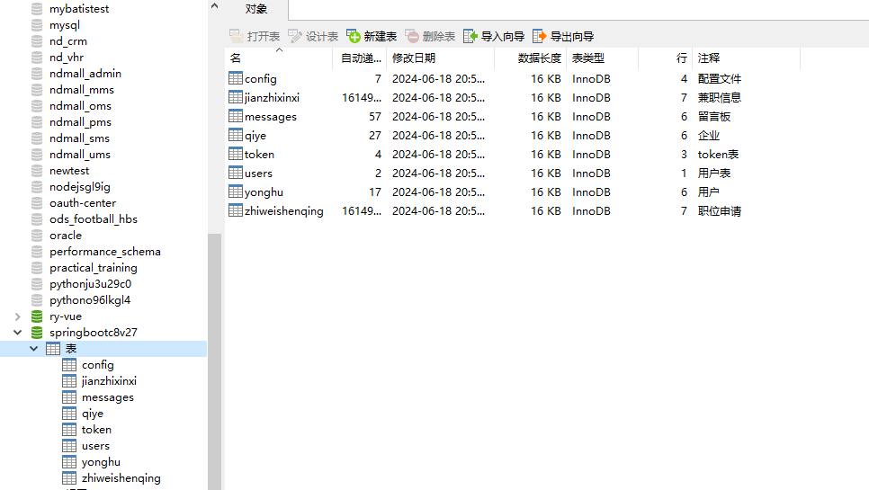
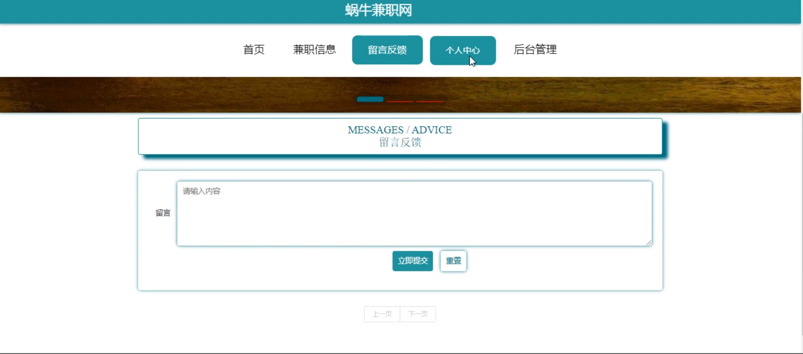
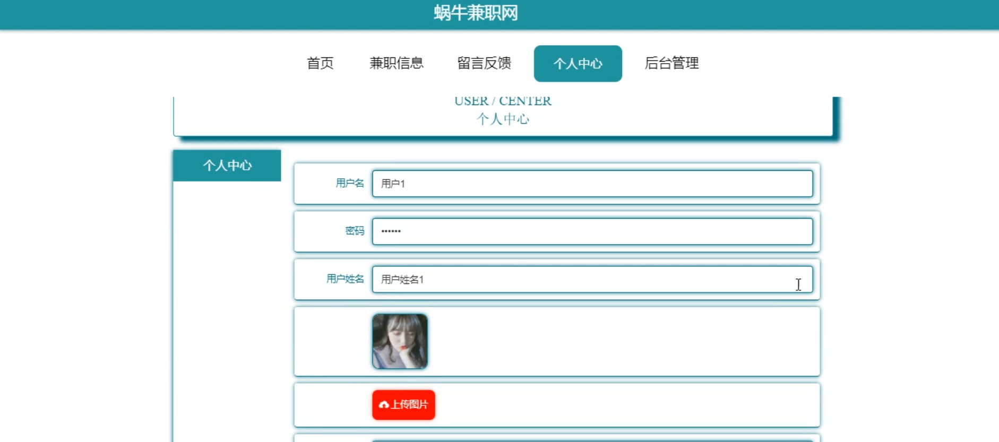
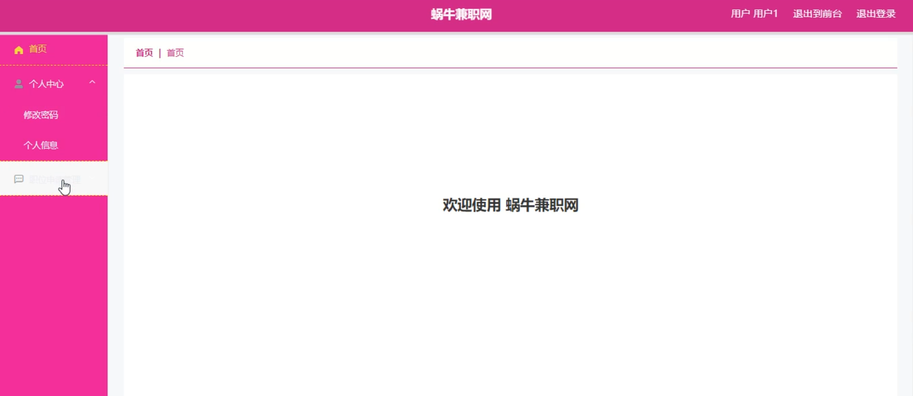
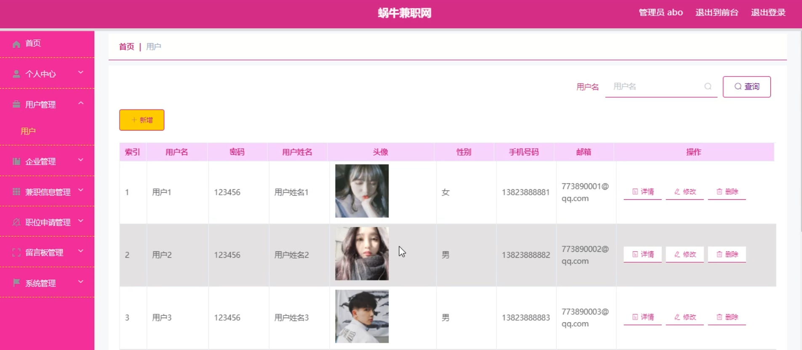

# 基于SSM的蜗牛兼职网

<h4 style='color:red'>联系不到我，就看我的主页 </h4> 
 
#### 介绍
蜗牛兼职网是一个专注于为用户和企业提供高效、便捷的兼职信息发布和申请平台。系统通过角色分离的设计，分别为管理端、企业端和用户端提供了特定的功能模块，以满足各自的需求和操作流程。通过该系统，企业可以轻松发布兼职信息，用户可以快速找到适合的兼职工作，而管理员则可以高效地管理平台上的所有信息和用户。

#### 技术栈介绍

后端技术栈：Springboot+Mysql+Maven

前端技术栈：Vue+Html+Css+Javascript+ElementUI

开发工具：Idea+Vscode+Navicate

#### 系统功能介绍

管理端功能模块

个人中心：管理员可以查看和修改个人信息，管理账户安全设置，确保账户的安全性和个性化设置。

用户管理：管理员可以管理平台上的所有用户信息，包括用户的注册、删除和权限设置，确保用户信息的完整性和准确性。

企业管理：管理员可以管理注册企业的信息，包括企业的注册、审核和权限设置，确保企业信息的真实性和合法性。

兼职信息管理：管理员可以审核和管理平台上的兼职信息，确保兼职信息的真实有效，防止虚假信息的传播。

职位申请管理：管理员可以查看和管理用户的职位申请信息，确保申请流程的顺畅和高效。

留言板管理：管理员可以查看和管理用户和企业的留言反馈，及时解决用户和企业的问题，提升平台服务质量。

系统管理：管理员可以进行系统配置和维护，确保系统的稳定运行和各项功能的正常使用。

企业端功能模块

个人中心：企业可以查看和修改企业账户信息，管理账户安全设置，确保账户的安全性和个性化设置。

兼职信息管理：企业可以发布和管理兼职职位信息，包括职位的发布、编辑和删除，方便快捷地进行兼职招聘。

职位申请管理：企业可以查看和管理用户的职位申请信息，方便企业进行筛选和面试安排，提高招聘效率。

用户端功能模块

兼职信息：用户可以浏览和搜索平台上的兼职信息，找到适合自己的兼职工作。

留言反馈：用户可以通过留言板向平台反馈问题和建议，方便与平台进行沟通和互动。

个人中心：用户可以查看和修改个人信息，管理账户安全设置，确保账户的个性化和安全性。

后台管理：

职位申请管理：用户可以查看和管理自己申请的职位信息，了解申请状态和企业反馈。

#### 系统作用

对管理端的作用

高效的用户和企业管理：管理员可以通过系统高效地管理用户和企业信息，确保平台的规范运营。

严谨的兼职信息管理：管理员可以审核和管理兼职信息，确保信息的真实性和可靠性，提升平台的可信度。

及时的问题解决：管理员可以通过留言板管理功能，及时解决用户和企业的问题，提升用户满意度。

对企业端的作用

便捷的职位发布：企业可以通过系统快速发布和管理兼职信息，提高招聘效率。

高效的申请管理：企业可以方便地查看和管理职位申请信息，进行筛选和面试安排，优化招聘流程。

对用户端的作用

丰富的兼职选择：用户可以通过系统浏览和搜索丰富的兼职信息，找到适合自己的兼职工作。

便捷的申请管理：用户可以方便地查看和管理自己申请的职位信息，了解申请进展，提高求职效率。

及时的反馈沟通：用户可以通过留言板功能与平台进行沟通和反馈，及时解决遇到的问题。

#### 系统功能截图

代码结构

数据库表

登录

首页

兼职信息

留言反馈

个人中心

管理后台

企业端

职位申请管理

管理端

#### 总结

蜗牛兼职网通过分角色设计，为管理端、企业端和用户端提供了全面的功能模块。管理端高效的用户和企业管理功能，以及严谨的兼职信息管理功能，为平台的规范运营提供了保障；企业端便捷的职位发布和高效的申请管理功能，提升了招聘效率；用户端丰富的兼职选择和便捷的申请管理功能，提高了求职效率。系统通过友好的用户界面和全面的功能设计，为用户和企业提供了一个高效、便捷的兼职信息发布和申请平台，提升了整体用户体验和管理效率。

#### 使用说明

创建数据库，执行数据库脚本 修改jdbc数据库连接参数 下载安装maven依赖jar 启动idea中的springboot项目

后台地址：http://localhost:8080/springbootc8v27/admin/dist/index.html

管理员  abo 密码 abo

前台地址：http://localhost:8080/springbootc8v27/front/index.html

